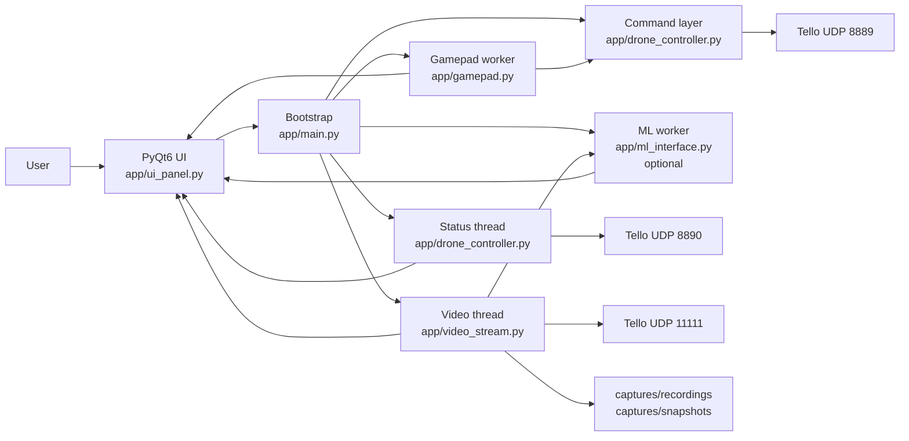
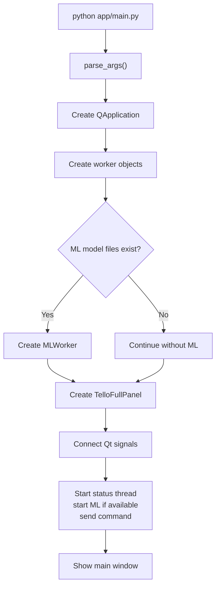

# Drone Project

Проста desktop-програма для керування DJI Tello через PyQt6.

Якщо зовсім по-простому: це "пульт керування" для дрона на комп'ютері. Програма показує відео з дрона, дає кнопки польоту, вміє читати геймпад, може накладати прості фільтри на відео, зберігати запис екрана та робити снапшоти. Якщо реального дрона немає, її можна запустити в `demo`-режимі.

## Що вміє програма

- Керувати Tello командами SDK через UDP.
- Показувати телеметрію: батарея, температура, швидкість.
- Вмикати та вимикати відеопотік.
- Застосовувати фільтри до відео: `Normal`, `Gray`, `Edges`, `Night Vision`.
- Записувати відео у `captures/recordings/`.
- Робити снапшоти у `captures/snapshots/`.
- Працювати з геймпадом.
- Опційно запускати ML-розпізнавання, якщо є модель у `app/model/`.
- Працювати без дрона через `--demo`.

## Що є головним файлом

Головна точка входу:

```bash
python app/main.py
```

Саме файл `app/main.py` запускає всю програму.

Файли в корені типу `drone.py`, `pyqt_practice.py`, `video_test.py`, `videotest2.py` зараз не входять у основний сценарій запуску. Це допоміжні або старі експерименти.

## Швидкий старт

### 1. Створити та активувати віртуальне середовище

Windows PowerShell:

```powershell
python -m venv .venv
.venv\Scripts\Activate.ps1
```

### 2. Встановити залежності

Мінімум для програми без ML:

```powershell
pip install PyQt6 pygame opencv-python numpy pillow
```

Для ML ще потрібен TensorFlow:

```powershell
pip install tensorflow
```

Примітка: якщо `tensorflow` не ставиться на твою версію Python, запускай програму без ML або використовуй Python-версію, яку підтримує твій TensorFlow-білд.

### 3. Запустити програму

Без реального дрона:

```powershell
python app/main.py --demo
```

З реальним Tello:

```powershell
python app/main.py
```

## Як запустити з реальним дроном

1. Увімкни дрон.
2. Підключи ноутбук до Wi-Fi мережі Tello.
3. Запусти програму: `python app/main.py`
4. Після старту програма відправляє команду `command`, щоб перевести Tello в SDK-режим.
5. Натисни `Video ON`, якщо хочеш відео.
6. Використовуй кнопки `Takeoff`, `Land`, `Forward`, `Left`, `Right` тощо.

## Як запустити без дрона

```powershell
python app/main.py --demo
```

Що буде в demo-режимі:

- замість реальних UDP-команд буде відповідь виду `demo ok: ...`
- телеметрія буде фейкова, але "жива"
- відео буде згенероване програмою
- можна тестувати UI, фільтри, запис відео, снапшоти та загальну логіку

## Як користуватися програмою

### Основні кнопки

- `Takeoff` - зліт
- `Land` - посадка
- `CMD` - ручне переведення в режим команд SDK
- `Emergency` - аварійна зупинка
- `Video ON` / `Video OFF` - запуск і зупинка відео
- `Start REC` / `Stop REC` - старт і стоп запису
- `Snapshot` - зберегти поточний кадр

### Відео

Після натискання `Video ON` програма:

1. відправляє дрону `streamon`
2. чекає приблизно 1 секунду
3. запускає потік читання відео
4. показує картинку в центральній панелі

### Геймпад

- Постав галочку `Enable` в секції `GAMEPAD`.
- Програма почне читати стіки й кнопки.
- Кнопки мапляться так:
  - `A` -> `takeoff`
  - `Y` -> `land`
  - `X` -> `emergency`

### ML

ML працює тільки якщо в репозиторії є файли:

- `app/model/keras_model.h5`
- `app/model/labels.txt`

Якщо цих файлів немає:

- програма все одно стартує
- кнопка ML буде вимкнена

## Куди зберігаються файли

- записи відео: `captures/recordings/`
- снапшоти: `captures/snapshots/`

## Структура проєкту

```text
drone-project/
|-- app/
|   |-- main.py                # точка входу
|   |-- ui_panel.py            # весь основний інтерфейс
|   |-- drone_controller.py    # UDP-команди і телеметрія
|   |-- video_stream.py        # відео, фільтри, запис, снапшоти
|   |-- gamepad.py             # читання геймпада
|   |-- ml_interface.py        # ML-потік для inference
|-- captures/                  # автоматично створюється для записів/снапшотів
|-- drone.py                   # старий/допоміжний файл, не main entry
|-- pyqt_practice.py           # експериментальний файл
|-- video_test.py              # тестовий файл
|-- videotest2.py              # тестовий файл
|-- README.md
```

## Архітектура простими словами

Програма складається з 5 головних частин:

1. `main.py` - усе збирає і з'єднує.
2. `ui_panel.py` - малює вікно, кнопки, статуси, відео.
3. `drone_controller.py` - говорить з дроном через UDP.
4. `video_stream.py` - приймає відео, фільтрує, записує, робить снапшоти.
5. `gamepad.py` і `ml_interface.py` - додаткові модулі для геймпада та ML.

### Схема програми



### Схема запуску



## Як реально тече інформація

### Команди

```text
Користувач натискає кнопку
-> UI викликає worker.send(...)
-> команда йде на Tello по UDP 8889
```

### Статус

```text
Tello шле state-пакети
-> TelloStatusThread читає UDP 8890
-> парсить рядок у dict
-> UI оновлює батарею / температуру / швидкість
```

### Відео

```text
Tello шле відео
-> TelloVideoThread читає потік UDP 11111 через OpenCV/FFmpeg
-> накладає фільтр і HUD
-> відправляє кадр у UI
-> за потреби зберігає запис або снапшот
```

### ML

```text
Video thread бере кадр
-> відправляє копію в MLWorker
-> MLWorker рахує прогноз
-> UI малює результати поверх відео
```

## Типові проблеми

### Програма стартує, але ML не працює

Це нормально, якщо в `app/model/` немає моделі. Програма задумана так, щоб без ML теж працювати.

### Немає відео

Перевір:

1. чи натиснув `Video ON`
2. чи ноутбук підключений до Wi-Fi Tello
3. чи дрон у SDK-режимі
4. чи OpenCV/FFmpeg коректно встановлені

### Не працює геймпад

Перевір:

1. чи бачить його `pygame`
2. чи поставлена галочка `Enable`
3. чи геймпад підключений до запуску програми

### Команди не доходять до дрона

Найчастіше причина одна з цих:

- ноутбук не підключений до Wi-Fi Tello
- дрон не увімкнений
- дрон не прийняв `command`
- інший процес займає потрібні UDP-порти

## Для технічного розбору

Детальніша технічна схема лежить тут:

[docs/ARCHITECTURE.md](docs/ARCHITECTURE.md)
