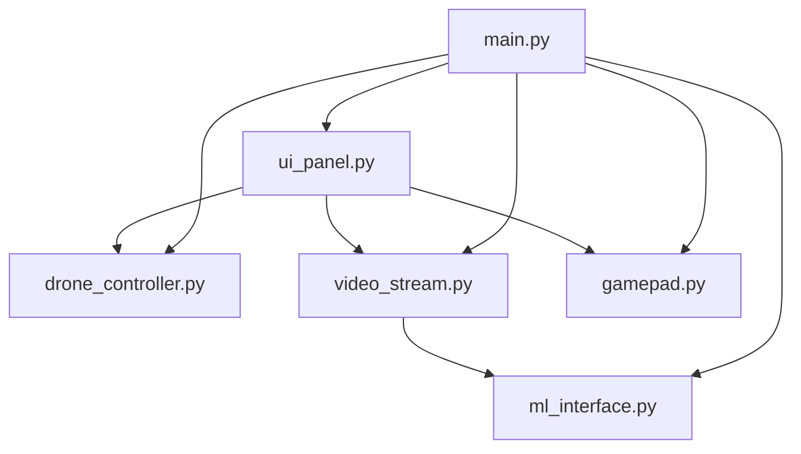
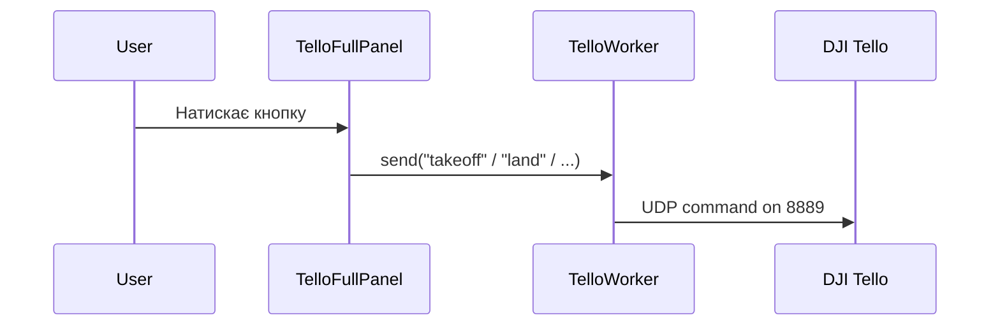
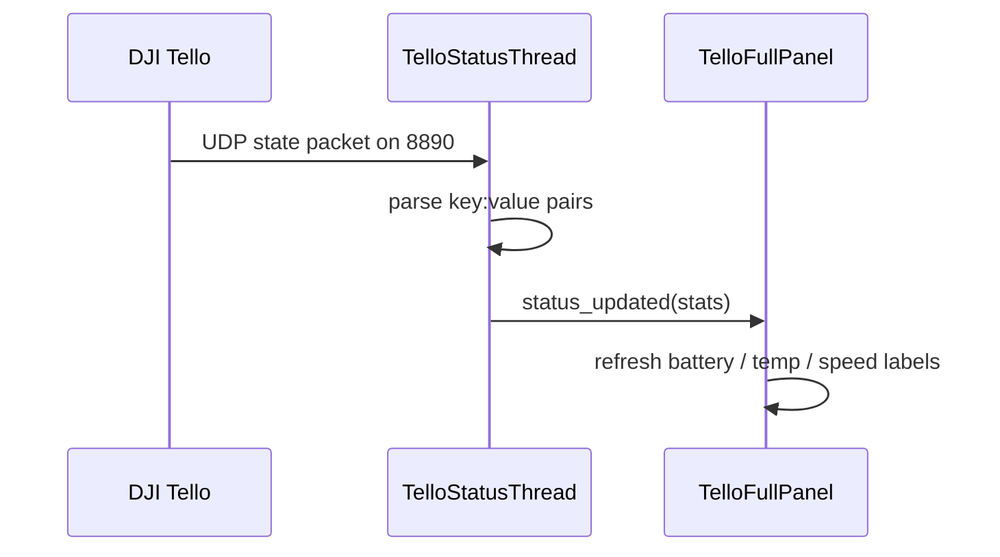
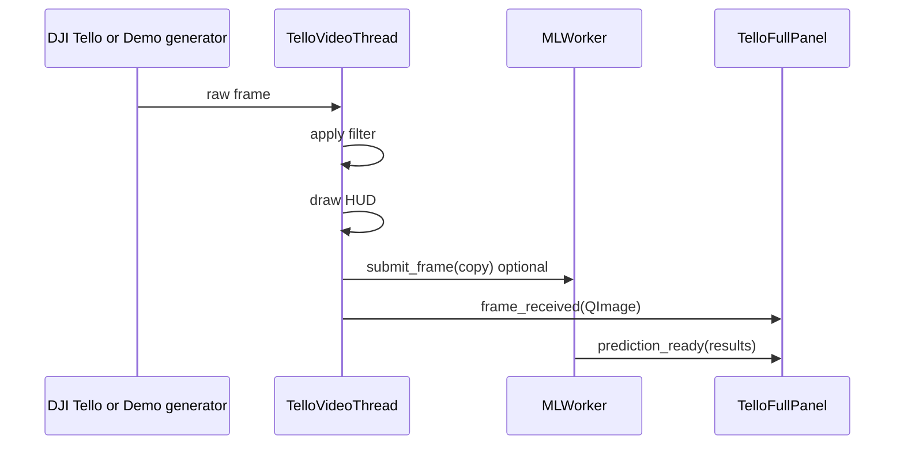

# Architecture

Тут описано технічну архітектуру проєкту без "магії".

## 1. Призначення

Застосунок є desktop-інтерфейсом для DJI Tello, який:

- відправляє команди керування
- отримує телеметрію
- приймає відеопотік
- дає локальні інструменти обробки відео
- може запускати ML-інференс поверх кадрів

## 2. Основні модулі

| Модуль | Роль |
|---|---|
| `app/main.py` | Точка входу, створює всі об'єкти, з'єднує сигнали, запускає застосунок |
| `app/ui_panel.py` | Головне вікно, кнопки, індикатори, відео-область, gamepad UI, LED UI, ML overlay |
| `app/drone_controller.py` | Команди Tello та прийом статусу |
| `app/video_stream.py` | Прийом відео з дрона або demo-генерація, фільтри, HUD, запис, снапшоти |
| `app/gamepad.py` | Читання геймпада через `pygame`, відправка RC-команд та кнопкових подій |
| `app/ml_interface.py` | Фоновий ML-інференс для кадрів |

## 3. Потоки виконання

| Компонент | Тип | Для чого потрібен |
|---|---|---|
| `QApplication` | main thread | Весь Qt UI |
| `GamepadWorker` | `QObject` + `QTimer` | Працює в main thread, бо `pygame.event.pump()` тут безпечніше |
| `TelloStatusThread` | `QThread` | Слухає телеметрію від дрона |
| `TelloVideoThread` | `QThread` | Читає відео, обробляє кадри, робить запис |
| `MLWorker` | `QThread` | Окремий інференс без блокування відео |
| `TelloWorker` | клас на базі `QThread` | Дає API для команд та signal `response_received` |

Важлива деталь: у поточному коді `TelloWorker` не запускається через `start()` як окремий активний цикл. Команди фактично йдуть напряму через метод `send()`. Тобто архітектурно це зараз радше "command gateway", ніж повноцінний окремий воркер-цикл.

## 4. Мережеві порти

| Напрямок | Порт | Значення |
|---|---|---|
| Команди до Tello | `8889/UDP` | SDK-команди типу `takeoff`, `land`, `streamon` |
| Статус від Tello | `8890/UDP` | Телеметрія `bat`, `templ`, `speed` тощо |
| Відео від Tello | `11111/UDP` | Потік відео для OpenCV |
| Локальний bind для команд | `9000/UDP` | Локальний сокет для командного каналу |

## 5. Сценарій старту

`app/main.py` робить таке:

1. Читає аргументи CLI.
2. Створює `QApplication`.
3. Створює backend-об'єкти:
   - `TelloWorker`
   - `TelloStatusThread`
   - `TelloVideoThread`
   - `GamepadWorker`
4. Перевіряє наявність ML-моделі.
5. Якщо модель існує, створює `MLWorker`.
6. Створює `TelloFullPanel`.
7. Підключає Qt signals.
8. Запускає статус-потік.
9. Запускає ML-потік, якщо доступний.
10. Відправляє `command`.
11. Показує головне вікно.

## 6. Режими роботи

### Реальний режим

- використовуються UDP-сокети
- телеметрія йде від реального Tello
- відео приходить через `udp://@0.0.0.0:11111`

### Demo-режим

Активується через:

```powershell
python app/main.py --demo
```

У цьому режимі:

- команди не йдуть у мережу
- статус генерується штучно
- відео генерується всередині `TelloVideoThread`
- запис, снапшоти, фільтри та UI можна тестувати без дрона

## 7. Схема залежностей



## 8. Сигнали між компонентами

### Основні Qt signals

| Звідки | Signal | Куди | Навіщо |
|---|---|---|---|
| `TelloWorker` | `response_received(str)` | `TelloFullPanel.handle_response` | Показати відповідь команди |
| `TelloStatusThread` | `status_updated(dict)` | `TelloFullPanel.handle_status_update` | Оновити телеметрію |
| `TelloVideoThread` | `frame_received(QImage)` | `TelloFullPanel.update_video_frame` | Показати кадр |
| `TelloVideoThread` | `status_message(str)` | `TelloFullPanel.handle_video_status` | Показати службовий текст |
| `TelloVideoThread` | `recording_state_changed(bool, str)` | `TelloFullPanel.handle_recording_state` | Оновити UI запису |
| `TelloVideoThread` | `snapshot_saved(str)` | `TelloFullPanel.handle_snapshot_saved` | Показати шлях до снапшоту |
| `GamepadWorker` | `command_signal(str)` | `TelloWorker.send` | Надіслати RC-команду |
| `GamepadWorker` | `button_signal(str)` | `TelloWorker.send` | Надіслати `takeoff` / `land` / `emergency` |
| `GamepadWorker` | `axis_signal(list)` | `TelloFullPanel.update_visualizer_sticks` | Рух візуалізатора стіків |
| `MLWorker` | `prediction_ready(list)` | `MLOverlayWidget.update_results` | Оновити ML-оверлей |

## 9. Потік команд



## 10. Потік телеметрії



## 11. Потік відео



## 12. Відео-стек

`TelloVideoThread` відповідає за:

- відкриття потоку через OpenCV + FFmpeg
- low-latency налаштування FFmpeg через `OPENCV_FFMPEG_CAPTURE_OPTIONS`
- фільтри:
  - `normal`
  - `gray`
  - `edges`
  - `night`
- HUD-накладку:
  - активний фільтр
  - поточний час
  - `REC`-індикатор
- локальний запис `.mp4`
- локальні `.png` снапшоти

## 13. ML-стек

`MLWorker` працює окремо від відеопотоку:

- має `queue.Queue(maxsize=1)`
- старий кадр викидається, якщо модель не встигає
- це не дає відеопотоку накопичувати лаг

Це означає:

- UI залишається плавним
- ML завжди працює по найсвіжішому доступному кадру
- затримка inference не блокує відео

## 14. Gamepad-стек

`GamepadWorker` не використовує окремий OS thread для читання input. Замість цього:

- `pygame` ініціалізується в `main.py`
- читання йде через `QTimer`
- опитування відбувається кожні 10 мс

Причина такого рішення: `pygame.event.pump()` безпечніше тримати на main thread разом з UI-циклом.

## 15. Зберігання файлів

При першому створенні `TelloVideoThread` програма автоматично створює:

```text
captures/
|-- recordings/
|-- snapshots/
```

## 16. Відомі обмеження

1. У репозиторії зараз немає `requirements.txt`, тому залежності описані текстом у `README`.
2. У репозиторії зараз немає `app/model/`, тому ML за замовчуванням неактивний.
3. `TelloWorker` формально є `QThread`, але реально використовується не як постійно працюючий окремий цикл.
4. Старі файли в корені не включені в production-style launch path.

## 17. Що покращувати далі

Якщо захочеш привести проєкт до більш чистої архітектури, логічні наступні кроки такі:

1. Додати `requirements.txt`.
2. Винести конфіг портів і шляхів у окремий config-модуль.
3. Переробити `TelloWorker` або в нормальний сервіс без `QThread`, або в реально працюючий command-thread.
4. Винести demo-режим в окремий adapter/mock layer.
5. Додати логування замість `print`.
